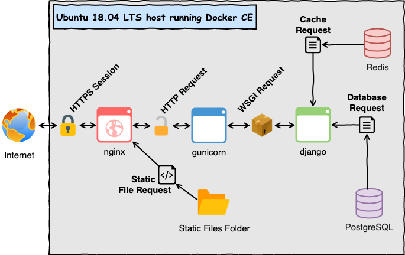

#  Docker Django Server

A dockerized django server that I use in personal projects as a backend.

## Architecture Notes:

_NOTE:_ diagram made with https://draw.io



- [Nginx](https://www.nginx.com/):
  - Acts as a fast and lightweight [reverse proxy](https://en.wikipedia.org/wiki/Reverse_proxy)
  - Provides HTTPS support through [Let's Encrypt](https://letsencrypt.org/) for free
  - Serves Django application static files (no need for [WhiteNoise](http://whitenoise.evans.io/en/stable/))
- [Gunicorn](https://gunicorn.org/)
  - Python [WSGI](https://en.wikipedia.org/wiki/Web_Server_Gateway_Interface)-to-HTTP Server for UNIX
  - Manages Django application thread pool
- [PostgreSQL](https://www.postgresql.org/)
  - SQL compliant database with Django community support
- [Redis](https://redis.io/)
  - PostgreSQL request caching through Django for UNIX

## Design Decision Notes:

- Django application _caches_ the entire session context in Redis instead of using PostgreSQL for write-though persistent sessions. Session context cache misses are currently only applicable for the Django admin application, and therefore unlikely. To enable persistent sessions, uncomment `'django.contrib.sessions'` in `INSTALLED_APPS` for `django/settings/common.py` and change `SESSION_ENGINE` to `django.contrib.sessions.backends.cached_db`. 
  - See: https://docs.djangoproject.com/en/dev/topics/http/sessions/#configuring-sessions
- Docker production design splits the internal Docker network into a fontend (Nginx) and backend (PostgreSQL & Redis) with the Django container serving as the link between the two for better Docker container isolation.
- Redis is configured to _not_ perform database snapshotting since a cache miss will not cause any current Django application logic issues:
  - See: https://redis.io/topics/persistence
- All _sensitive_ production configuration files are stored in a directory called `secrets` which is not tracked by Git. 
  - See: `Application Secrets` README section below for more information
- All production Docker containers are running as non-`root` users. Only the Nginx and Django containers must share the same user/group ID in order to share a Docker volume containing Django's static files to be served by Nginx.

## Host Setup Notes:

- [Ubuntu 18.04 LTS amd64 ISO download](https://ubuntu.com/download/server/thank-you?version=18.04.4&architecture=amd64)
- [Docker CE Install](https://docs.docker.com/install/linux/docker-ce/ubuntu/)
- [Docker Compose Install](https://docs.docker.com/compose/install/)
- Install Python3.7 and [pipenv](https://pipenv.pypa.io/en/latest/):

  ```bash
  sudo apt-get update
  sudo apt-get upgrade
  sudo apt-get install -y python3.7 python3-pip
  python3.7 -m pip install --user pipenv
  echo 'export PATH="${HOME}/.local/bin:$PATH"' >> ~/.bashrc
  source ~/.bashrc
  ```
- Install Django application dependencies:

  ```bash
  sudo apt-get install -y \
    libpq-dev \
    python3.7-dev \
    build-essential \
    python3-setuptools # psycopg2 (Python postgresql) dependencies 
  cd django
  pipenv install --dev
  ```
- Remove Ubuntu snapd:

  ```bash
  sudo apt autoremove --purge snapd gnome-software-plugin-snap
  sudo rm -rf /var/cache/snapd/
  rm -fr ~/snap
  ```

## Django Application Development Notes:

  ```bash
  export DJANGO_SETTINGS_MODULE=settings.development # set django settings module
  cd django                                          # enter project directory
  pipenv shell                                       # start virtualenv shell
  rm -rf __dev-*                                     # remove old dev files
  python manage.py collectstatic --no-input          # recollect static files 
  python manage.py migrate                           # setup database schema
  python manage.py runserver 0.0.0.0:8000            # spin up django app
  # ~~~~~~~~~~~~~~~~~~~~~~~~~~~~~~~~~~~~~~~~~~~~~~~~~~~~~~~~~~~~~~~~~~~~~~~~~~~
  # MISC development commands
  # ~~~~~~~~~~~~~~~~~~~~~~~~~~~~~~~~~~~~~~~~~~~~~~~~~~~~~~~~~~~~~~~~~~~~~~~~~~~
  python manage.py createsuperuser          # add test admin user to database
  python manage.py loaddata app_whoami.json # load JSON fixture (takes a while)
  python manage.py flush                    # drop all data in each DB table
  exit                                      # exit virtual environment
  ```

## MaxMind GeoIP Database Management Notes:

- MaxMind account creation:
  - [Create a GeoIP lite account](https://www.maxmind.com/en/geolite2/signup)
  - [Reset the password on the new account so you can login](https://www.maxmind.com/en/account/forgot-password)
- Generating a new MaxMind license key:
  - [Login in](https://www.maxmind.com/en/account/login) and browse to Services > My License Key 
  - Create a new license key and save the key to `secrets/geoip.key`
- Getting GeoIP Lite direct download URLs:
  - Browse to Account Summary > Download Databases
  - Copy permalinks for needed CSV formatted database files 
  - Update the `URLS` variable in `django/app_whoami/fixtures/update.py` as needed
- Updating django JSON fixture file `app_whoami.json`:

  ```bash
  cd django                                 # enter project directory
  pipenv shell                              # start virtualenv shell
  cd app_whoami/fixtures                    # enter fixtures directory
  ./update.py -k ../../../secrets/geoip.key # generate new JSON fixture
  ```
  
- Loading Django JSON fixture `app_whoami.json` into DB:
  - **DEVELOPMENT:**
    - Connect to the DB:

      ```bash
      cd django                # enter project directory
      pipenv shell             # start virtualenv shell
      python manage.py dbshell # start a DB SQL shell
      ```
      
    - _-- If Django DB schema has **not** changed --_ remove old table data:

      ```mysql
      SELECT name FROM sqlite_master 
          WHERE name LIKE '%whoami%'; -- get tables
      DELETE FROM <table_name>;       -- drop table data
      .exit                           -- exit db connection
      ```
      
    - _-- If Django DB schema **has** changed --_ delete tables:

      ```mysql
      SELECT name FROM sqlite_master 
          WHERE name LIKE '%whoami%'; -- get tables
      DROP TABLE <table_name>;        -- drop table
      .exit                           -- exit db connection
      ```
      
    - Import the new fixtures:

      ```bash
      python manage.py migrate                  # re-create any broken tables
      python manage.py loaddata app_whoami.json # load JSON fixture (takes a while)
      exit                                      # exit virtual environment
      ```
    
  - **PRODUCTION:** 
    - Connect to the DB:

      ```bash
      sudo systemctl start web                                   # make sure django app is running
      sudo docker cp app_whoami.json django:/tmp/app_whoami.json # copy fixtures into container
      sudo docker exec -it django /bin/bash                      # get a bash shell in django container
      cd /app                                                    # navigate to project directory
      python manage.py dbshell                                   # start a DB SQL shell
      ```
      
    - _-- If Django DB schema has **not** changed --_ remove old table data:

      ```mysql
      SELECT tablename FROM pg_catalog.pg_tables 
          WHERE tablename LIKE '%whoami%';       -- get tables
      DELETE FROM <table_name>;                  -- drop table data
      \q                                         -- exit db connection
      ```

    - _-- If Django DB schema **has** changed --_ delete tables:

      ```mysql
      SELECT tablename FROM pg_catalog.pg_tables 
          WHERE tablename LIKE '%whoami%';       -- get tables
      DROP TABLE <table_name>;                   -- drop table data
      \q                                         -- exit db connection
      ```

    - Import the new fixtures:

      ```bash
      python manage.py migrate                       # re-create any broken tables
      python manage.py loaddata /tmp/app_whoami.json # load JSON fixture (takes a while)
      exit                                           # exit container shell
      ```

## Production Notes:

- Build application images:

  ```bash
  # !!! snapshot current SQL db:
  source secrets/postgres.env && \
    sudo docker-compose -f docker/docker-compose.yml exec postgres pg_dumpall -U $POSTGRES_USER > dump.sql
  sudo systemctl stop web                                                  # stop apps
  sudo docker rmi --force $(sudo docker images -aq)                        # remove apps
  sudo docker build --tag app_nginx -f docker/app_nginx.Dockerfile .       # rebuild nginx
  sudo docker build --tag app_redis -f docker/app_redis.Dockerfile .       # rebuild redis
  sudo docker build --tag app_django -f docker/app_django.Dockerfile .     # rebuild django
  sudo docker build --tag app_postgres -f docker/app_postgres.Dockerfile . # rebuild db
  # !!! restore SQL db snapshot:
  sudo docker volume rm docker_postgres_data                               # remove old db
  sudo systemctl start web                                                 # start apps
  sudo docker cp dump.sql postgres:/tmp/dump.sql                           # copy snapshot into container
  source secrets/postgres.env && \
    sudo docker-compose -f docker/docker-compose.yml exec -T postgres psql -U $POSTGRES_USER -d $POSTGRES_DB < dump.sql
  # remove DB backup
  rm dump.sql
  sudo systemctl restart web 
  ```
  
- Install docker-compose `web` service:
  - Create a `/etc/systemd/system/web.service` file with the following content: (**NOTE:** replace `<path to docker-compose.yml>` below with host system's path):

    ```bash
    [Unit]
    Description=Docker Compose App Service
    Requires=docker.service
    After=docker.service
    
    [Service]
    Type=oneshot
    RemainAfterExit=yes
    ExecStart=/usr/local/bin/docker-compose -f <path to docker/docker-compose.yml> up -d
    ExecStop=/usr/local/bin/docker-compose -f <path to docker/docker-compose.yml> down
    TimeoutStartSec=0
    
    [Install]
    WantedBy=multi-user.target
    ```
    
  - Install the service:

    ```bash
    sudo systemctl enable web
    ```

- Connecting to PostgreSQL DB:
  
  ```bash
  sudo docker exec -it django /bin/bash # get a bash shell in django container
  cd /app                               # navigate to project directory
  python manage.py dbshell              # start a DB shell
  ```
  
- Connecting to Redis DB:
  
  ```bash
  sudo docker exec -it redis /bin/bash # get a bash shell in redis container
  redis-cli --pass $REDIS_PASS         # start a DB shell
  ```
  
- Helpful production debugging commands:
  
  ```bash
  # test bring up all the services
  sudo docker-compose -f docker/docker-compose.yml up -d
  # stop all running services
  sudo docker-compose -f docker/docker-compose.yml down
  # stop all running containers
  sudo docker stop $(sudo docker ps -aq)
  # delete all containers
  sudo docker rm $(sudo docker ps -aq)
  # delete all docker volumes
  sudo docker volume rm $(sudo docker volume ls -q)
  # delete all docker images
  sudo docker rmi $(sudo docker images -aq)
  # spawn a bash shell in a running container
  sudo docker exec -it <container_name> /bin/bash
  # create a standalone container from image with bash as entrypoint
  sudo docker run -it --entrypoint /bin/bash <image_name> -s
  ```

- Google Domains with Dynamic DNS in pfsense:
  - https://support.google.com/domains/answer/6147083?hl=en
  - https://linuxincluded.com/dynamic-dns-with-google-domains/
  - https://ttlequals0.com/2015/03/24/google-domains-dynamic-dns-on-pfsense/
  
- Nginx TLS configuration/security resources:

  - https://gist.github.com/nrollr/9a39bb636a820fb97eec2ed85e473d38
  - https://wiki.mozilla.org/Security/Server_Side_TLS
  - https://github.com/trimstray/nginx-admins-handbook/blob/master/doc/RULES.md
  - https://ssl-config.mozilla.org/
  - **[TEST TLS]**: https://www.ssllabs.com/ssltest/analyze.html?d=arey.dev&hideResults=on

## Application Secrets:

- `geoip.key`: Contains MaxMind account license key for GeoIPLite2 database offline downloads

- `app.env`: Django Docker application container environmental variables
  - [`DJANGO_SETTINGS_MODULE`](https://docs.djangoproject.com/en/dev/topics/settings/#envvar-DJANGO_SETTINGS_MODULE)
  - [`DJANGO_DEBUG`](https://docs.djangoproject.com/en/dev/ref/settings/#debug)
  - [`DJANGO_SECRET_KEY`](https://docs.djangoproject.com/en/dev/ref/settings/#std:setting-SECRET_KEY):
    
    ```python
    import django.core.management.utils
    django.core.management.utils.get_random_secret_key()
    ```
  
- `postgres.env`: PostgreSQL Docker container environmental variables
  - [`POSTGRES_PORT`](https://docs.djangoproject.com/en/dev/ref/settings/#databases)
  - [`POSTGRES_HOST`](https://docs.djangoproject.com/en/dev/ref/settings/#databases)
  - [`POSTGRES_DB`](https://hub.docker.com/_/postgres/)
  - [`POSTGRES_USER`](https://hub.docker.com/_/postgres/)
  - [`POSTGRES_PASSWORD`](https://hub.docker.com/_/postgres/)
  
- `redis.env`: Redis environmental variables for [`django-redis`](https://github.com/jazzband/django-redis) Django plugin in the Django Docker container
  - [`REDIS_DB`](https://jazzband.github.io/django-redis/latest/#_configure_as_cache_backend)
  - [`REDIS_TTL`](https://docs.djangoproject.com/en/dev/ref/settings/#timeout)
  - [`REDIS_PORT`](https://jazzband.github.io/django-redis/latest/#_configure_as_cache_backend)
  - [`REDIS_HOST`](https://jazzband.github.io/django-redis/latest/#_configure_as_cache_backend)
  - [`REDIS_CONNECTION_TYPE`](https://jazzband.github.io/django-redis/latest/#_configure_as_cache_backend)
  - [`REDIS_PASS`](https://jazzband.github.io/django-redis/latest/#_configure_as_cache_backend)
  
- `redis.password.conf`: Redis default user password using `requirepass` config option.
  
    - **NOTE**: password must match the `REDIS_PASS` value in `redis.env`
    
- `nginx.env`: Nginx environmental variables to manage LetsEncrypt `certbot` tool for TLS certifications
    - [`CERT_DOMAIN`](https://certbot.eff.org/docs/using.html#webroot)
    - [`CERT_RENEW_DELAY`](https://letsencrypt.org/docs/faq/#what-is-the-lifetime-for-let-s-encrypt-certificates-for-how-long-are-they-valid)
    - [`CERT_RSA_KEY_SIZE`](https://certbot.eff.org/docs/using.html#certbot-command-line-options)
    - [`CERT_EMAIL`](https://certbot.eff.org/docs/using.html#certbot-command-line-options)
    - [`CERT_CREATE_FLAGS`](https://certbot.eff.org/docs/using.html#certbot-command-line-options): Used for `certbot certonly` command
    - [`CERT_RENEW_FLAGS`](https://certbot.eff.org/docs/using.html#certbot-command-line-options): Used for `certbot renew` command

## Application Resources:

- [Redis Server Configuration](https://redis.io/topics/config)
- [Redis Server Security](https://redis.io/topics/security)
- [Gunicorn Command Line Arguments](https://docs.gunicorn.org/en/latest/settings.html#settings)
- [Docker `run` Comand Line Reference](https://docs.docker.com/engine/reference/commandline/run/)
- [Dockerfile Reference](https://docs.docker.com/engine/reference/builder/)
- [Docker Compose Reference](https://docs.docker.com/compose/compose-file/)
- [LetsEncrypt `certbot` Documentation](https://certbot.eff.org/docs/index.html)

